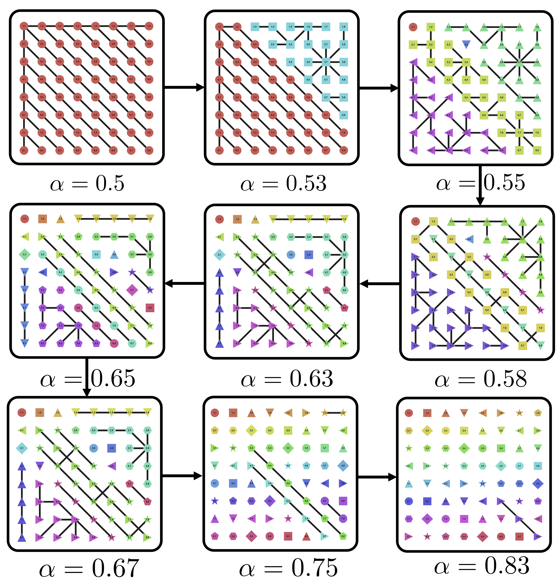

# JAKS Research Repository

This repository contains research code for circuit stability analysis and future work on problem decomposition. It is organized into two main sections:

## Circuit Stability Research



The `circuit-stability/` directory contains the official implementation of [Circuit Stability Characterizes Language Model Generalization](https://arxiv.org/abs/2505.24731) (ACL 2025). All of the code in the subdirectory `circuit-stability/code/src/eap/` is extensively borrowed from [EAP-IG](https://github.com/hannamw/eap-ig). Some modifications are made to accommodate [Group-Query Attention](https://arxiv.org/abs/2305.13245) in more modern architectures such as Llama 3 and Gemma 2.

## Repository Structure

```
├── circuit-stability/           # Circuit stability research (published work)
│   ├── code/
│   │   ├── src/                # Source code
│   │   │   ├── cdatasets/      # Dataset implementations
│   │   │   ├── eap/           # Edge Attribution Patching
│   │   │   └── experiments/    # Experiment scripts
│   │   ├── tests/             # Test files
│   │   └── compare_circuits.py # Circuit comparison tools
│   ├── experiments/
│   │   ├── config/            # Environment & setup files
│   │   └── notebooks/         # Jupyter notebooks
│   ├── results/
│   │   ├── outputs/           # JSON/pickle output files
│   │   └── visualizations/    # Generated plots
│   └── figures/               # Paper figures
└── future-work/                # Future problem decomposition research
``` 

## Requirements and Dependencies

The circuit stability codebase relies on a `conda` environment whose dependencies are listed in `circuit-stability/experiments/config/environment.yml`. Before installing this environment, you need to install `Graphviz` (required for circuit visualization). To make things easy, you can directly run 

```bash
git clone <this-repo>
cd JAKS
cd circuit-stability/experiments/config
./install.sh
conda activate ml
```

**Below are instructions for manual installation.**

**macOS:**
```bash
brew install graphviz
```
**Ubuntu/Debian:**
```bash
sudo apt-get update
sudo apt-get install graphviz
```
**Windows:**
Download and install from [https://graphviz.org/download/](https://graphviz.org/download/)

### Python Environment Setup

1. **Clone the repository:**
   ```bash
   git clone https://github.com/yourusername/cs-codebase.git
   cd cs-codebase
   ```

2. **Create and activate the conda environment:**
   ```bash
   conda env create -f circuit-stability/experiments/config/environment.yml
   conda activate ml
   ```

3. **Verify the installation:**
   ```bash
   python -c "import torch; import transformer_lens; import pygraphviz; print('All dependencies installed successfully!')"
   ```

### Alternative Installation (if conda is not available)

If you don't have conda installed, you can use pip with a virtual environment:

```bash
# Create virtual environment
python -m venv 

# Activate virtual environment
# On macOS/Linux:
source cs-env/bin/activate
# On Windows:
cs-env\Scripts\activate

# Install dependencies (this will take some time)
pip install torch==2.4.1
pip install transformers==4.44.2
pip install transformer-lens==2.11.0
pip install pygraphviz==1.14
pip install -r <(conda env export -f circuit-stability/experiments/config/environment.yml | grep "pip:" -A 1000 | tail -n +2 | sed 's/^      - //')
```

### Computational Requirements

Case Study I and Case Study II can be run on a single NVIDIA A100 80GB GPU. However, Case Study III needs two of the aforementioned GPUs.


## Citation

If you use this code in your research, please cite:

```bibtex
@inproceedings{
    sun2025circuit,
    title={Circuit Stability Characterizes Language Model Generalization},
    author={Alan Sun},
    booktitle={The 63rd Annual Meeting of the Association for Computational Linguistics},
    year={2025},
    url={https://openreview.net/forum?id=2914j8175g}
}
```

## Acknowledgments

- [EAP-IG](https://github.com/hannamw/eap-ig) for the base circuit discovery method
- [TransformerLens](https://github.com/neelnanda-io/TransformerLens) for model analysis capabilities
- The broader mechanistic interpretability research community for foundational work 


